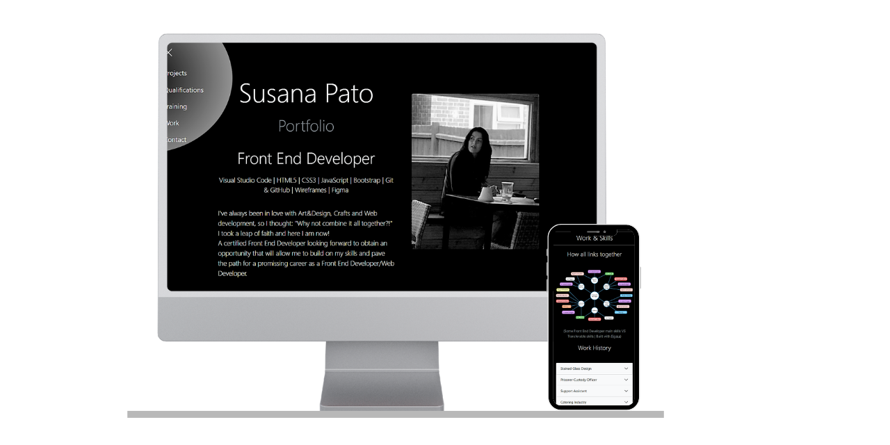

# My Portfolio

This project is my professional portfolio, the ultimate goal it's to showcase to potential employers and/or customers my progress so far in terms of coding habillities, appropriate usage of different external resources as Formspree, Canva or Figma. Ability to produce clean, maintainable and re-usable code. Experience building responsive websites using HTML, CSS, Bootstrap and JavaScript. 


## Table of contents

- [Overview](#overview)
  - [The Portfolio](#the-portfolio)
  - [Screenshot](#screenshot)
  - [Links](#links)
- [My process](#my-process)
  - [Ux](#ux)
  - [Built with](#built-with)
  - [Testing](#testing)
  - [Deployment](#deployment)
  - [Useful resources and acknowledgements](#useful-resources-and-acknowledgements)
- [Author](#Author)

## Overview

### The Portfolio

Built to showcase my achievements so far and help establish a link between the past, the present and how I am looking to move forward in order to keep paving the path for future goals. 

Users should be able to:

- View the optimal layout for the site depending on their device's screen size
- View project cards and be able to scroll down the text
- Visit each project website throught the button "visit"
- Access full Education and Job description text
- Easily find their way up and down the throught the menu or/and "Go back up" buttons
- Contact the author

### Screenshot



### Links

- GitHub Repository URL: [https://github.com/Susafp/portfolio.git]
- Live Site URL: [https://susafp.github.io/portfolio/]

## My process

### UX & UI

**Colour pallet**

- Background: #212529
- Text-light: #f8f9fa and Text-muted: #6c757d

**Features**

[Home page](index.html)

 - Navigation menu, with links to page main sections.
 - Header, with an introduction text and image. 
 - Projects section, with Scrollable Project  Cards and a "visit" button each.
 "Back to top" button
 - Education section,
 Qualification Accordion, Training notes image and a "Back to top" button
 - Work Experrience Accordion and 
 Skills section, with a Skills board image.
 "Back to top" button.
 - Page Footer,
 Social Links, Contact link, Author and copyright

[Contact page](contact.html)

 - Alert with "Thank you note"
 - Navigation Menu
 - Contact Form
 - Page Foooter
 With Social Links, Author and copyright

### Built with

- [**Visual Studio Code**](https://code.visualstudio.com/)
   - My development environment of choice to work on this project.
- [**HTML5**](https://developer.mozilla.org/en-US/docs/Web/Guide/HTML/HTML5)
    - To get all my elements in and set the project structure.
- [**CSS3**](https://developer.mozilla.org/en-US/docs/Web/CSS/CSS3)
    - To add the styles needed to achieve the desired look .
- [**Bootstrap**](https://getbootstrap.com/)
    - The project uses **Bootstrap v5.2** to add a responsive grid system, prebuilt components, plugins built on jQuery, and Bootstrap styles to my website, before adding my custom styles.
- [**jQuery**](https://jquery.com)
    - The project uses **jQuery** to simplify DOM manipulation. This is the standard jQuery that is built with Bootstrap components. 
- [**JavaScript**](https://www.javascript.com/)
    - I've used **JavaScript** to add functionality to the Navigation menu.
- [**Formspree**](https://formspree.io/)
    - I've used **Formspree** to be able to receive in my email all messages submited by users throught the Portfolio´s contact form.
- [**Figma**](https://www.figma.com/)
    - The design tool that I've used to create the Training image (assets/images/noteBoard.jpg) and the Skills board image (assets/images/skillsBoard.jpg).
- [**Canva**](https://www.canva.com/en_gb/)
    - The design tool that I've used to create a presentation image for this project (design/responsive.png).
- [**Git**](https://git-scm.com/)
    - I've used **Git** as a version control system to regularly add and commit changes made to project in Visual Studio Code, before pushing them to GitHub.
- [**GitHub**](https://github.com/)
    - I've used **GitHub** as a remote repository to push and store the committed changes to my project from Git. I've also used GitHub pages to deploy my website in a live environment.

### Testing

I've mainly used Microsoft Edge's Development tools to constantly test each new piece of code to ensure its responsiveness in different size screens. I also tested my website with Google Chrome and Mozilla Firefox.

#### HTML, CSS and JavaScript Code Validation

To test this website, I used:

1. [W3C HTML Validator tool](https://validator.w3.org/#validate_by_input) to validate my HTML code. 

2. [W3C CSS Validator tool](https://jigsaw.w3.org/css-validator/#validate_by_input) to validate my CSS code.

3. [Code Beautyfy JavaScript Validator tool](https://codebeautify.org/jsvalidate) to validate my JavaScript code.

### Deployment

The hosting platform that I've used for my project is GitHub Pages. To deploy my website to GitHub pages, I used the following steps:

1. Loaded the terminal window in my Visual Studio Code workspace.
2. Initialised Git using the `git init` command.
3. Added all files to the Staging area (Git) using the `git add .` command.
4. Committed the files to Git using the `git commit -m "Initial commit"` command.
5. Created a new repository in GitHub called 'JS-Milestone-two'.
6. Copied the below code from GitHub into the terminal window in my Visual Studio Code workspace:

```git remote add origin https://github.com/Susafp/portfolio.git```,
```git branch -M main```,
```git push -u origin main```.

7. Entered my GitHub username and password to push the files from Git to GitHub.
8. Went into 'Settings' on my repository page in GitHub.
9. Selected the 'main branch' option under the 'GitHub Pages' section.
10. Ran several regular commits throughout my project.

### Running Code Locally

To run my code locally, users can download a local copy of my code to their desktop by completing the following steps:

1. Go to [my GitHub repository](https://github.com/Susafp/portfolio.git).
2. Click on 'Clone or download'.
3. Click on 'Download ZIP'.
4. Once downloaded, extract the zip file's contents and run my website locally.

### Useful resources and acknowledgments

- [The Net Ninja](https://www.youtube.com/channel/UCW5YeuERMmlnqo4oq8vwUpg) - This is the place where I find most of the answers for my questions. 
Thank you Net Ninja!

## Author

- Susana Fragoso Pato - [@Susafp](#)
- Github - [Susafp](https://github.com/Susafp)
- Linkedin - [Susana-fP](https://www.linkedin.com/in/susana-fp/)


